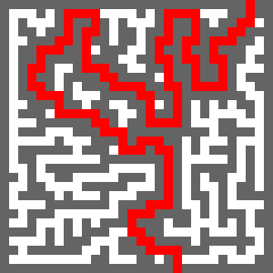

# MazeAvatar

This is a simple project for me to learn Elixir.

The idea is to generate a maze and making an avatar with it in PNG format.

## Used libraries

I use [PNG](https://hex.pm/packages/png) lib (it's an erlang lib) for saving the picture as a PNG file (indexed palette).

I use another library for [benchmarking](https://github.com/simonced/elixir-benchmark) the maze generation speed. It's one I made simply.

## Concept

I wanted to generate a maze picture we then could use for avatars maybe.  
The specs I decided are:

- entrance at the top (random location)
- perfect maze generation algorithm (only one exit, no loop)
- exit at the bottom
- display of the path from the entrance to the exit (gives fun results)

## Mix tasks

All commands displayed bellow are to be launched from the project directory with your terminal.

### Generating a maze in ASCII

    mix generate 30 30
	
Will give you something like:

    XXXXXXXXXXXXXXXXXXXXXXXXXXXXXXXXXXXXXX..XXXXXXXXXXXXXXXXXXXX
    XX  XXXX          XX  XX......XXXX  XX..........XXXX  XX  XX
    XX        XX  XXXXXX......XX....XX  XXXXXXXXXX....XX      XX
    XXXXXX  XXXX    XXXX..XXXXXXXX........      XXXX..XX  XX  XX
    XX      XXXXXXXXXX....XX  XXXXXXXXXX..XXXXXXXXXX..XX  XX  XX
    XX  XX  XX..........XXXX  XX      XX..  XX........XX  XXXXXX
    XX  XXXXXX..XXXXXXXXXX        XX  XX..XXXX..XXXXXXXX    XXXX
    XX......XX....XX  XXXX  XXXXXXXX  XX........XX    XXXX    XX
    XX..XX..XXXX..XX  XX      XXXX    XXXXXXXXXXXXXX    XXXX  XX
    XX..XX....XX..XX      XX    XX  XXXXXX  XX  XXXXXX    XX  XX
    XX..XXXX......XXXXXXXXXXXX  XX      XX          XXXX      XX
    XX....XXXXXXXXXX        XXXXXXXXXX      XXXXXX    XXXX  XXXX
    XXXX....XX    XXXX  XX  XX      XX  XXXXXX  XXXX        XXXX
    XXXXXX..XXXX        XX  XX  XX  XX            XXXXXXXX    XX
    XXXX  ....XXXXXX  XXXX  XX  XX  XXXXXXXXXX  XXXX    XXXX  XX
    XX    XX..XX      XX        XX      XX        XXXX  XX    XX
    XX  XXXX..XXXX  XXXXXXXXXXXXXXXXXX  XXXXXXXX    XX  XX  XXXX
    XXXXXX....XX    XX  XX          XX      XXXXXX      XX    XX
    XXXX....XXXX  XXXX      XXXXXXXXXXXXXX      XXXXXX  XXXX  XX
    XX....XXXX    XX    XXXXXX          XXXXXX      XXXXXXXX  XX
    XX..XXXXXX  XXXXXX          XXXX  XXXX  XXXXXX        XX  XX
    XX......XX    XX    XXXXXX  XX    XXXX      XXXXXXXX  XX  XX
    XXXXXX..XXXX  XXXX      XXXXXX  XXXX    XX        XX  XX  XX
    XX  XX....XX    XXXXXX    XXXX        XXXX  XXXX  XX      XX
    XX  XXXX..XXXX      XXXX    XXXXXXXXXXXX    XXXX  XXXX  XXXX
    XX    XX....XX  XX    XXXX      XXXX  XX  XXXX      XX    XX
    XX  XXXXXX..XX  XXXX  XXXXXXXX        XX    XXXXXXXXXXXX  XX
    XX      XX..XXXXXX    XX  XXXXXXXXXX  XXXX          XX    XX
    XX  XX    ..        XXXX                XX  XX  XX      XXXX
    XXXXXXXXXX..XXXXXXXXXXXXXXXXXXXXXXXXXXXXXXXXXXXXXXXXXXXXXXXX
	
For better visibility, I use 2 characters wide for ASCII display.

### Generating a maze in PNG

    mix generate_png 30 30 maze.png
	
Resulting picture:



The resulting picture will be saved in the project root folder.  
The picture above has been scaled up, because otherwise it's 30x30px and is very small.

### Generating the step when digging the maze

Just for fun, I added an option that saves each digging step as a picture.  
Picture names are numbered in sequence from 1.

    mix generate_png_anim 30 30 maze.png
	
Preview of the animation:

[](https://www.youtube.com/watch?v=pypfuBaT5HY)

**Note:** The animation has been made on Youtube, mazeAvatar only generates all the frames of the digging process.

## Parameters

Not many things can be tweaked yet, but you can at least change the colors used in the PNG files.

File: `lib/mazeAvatar.png.ex`

Settings:

```elixir

  # constant keyword list
  @colors [hole: {255, 255, 255},
           wall: {100, 100, 100,},
           path: {255, 0, 0},
           dig: {0, 255, 0}]

```

## Known bugs

One bug that I know of and that I have yet to figure out:

- the algorithm fails when trying to make a NON square shaped maze

If you want to have a look as well, PR are welcome ;)

## What's next?

I am not sure if I'll improve it or not, I learned a lot of Elixir thanks to that project and I feel I can move on other topics with Elixir now.  
But I would like to add some options like:

- pixel size of the result picture (currently only 1px size per "block of data")
- command line parameter to display the path to the exit (ON/OFF)
